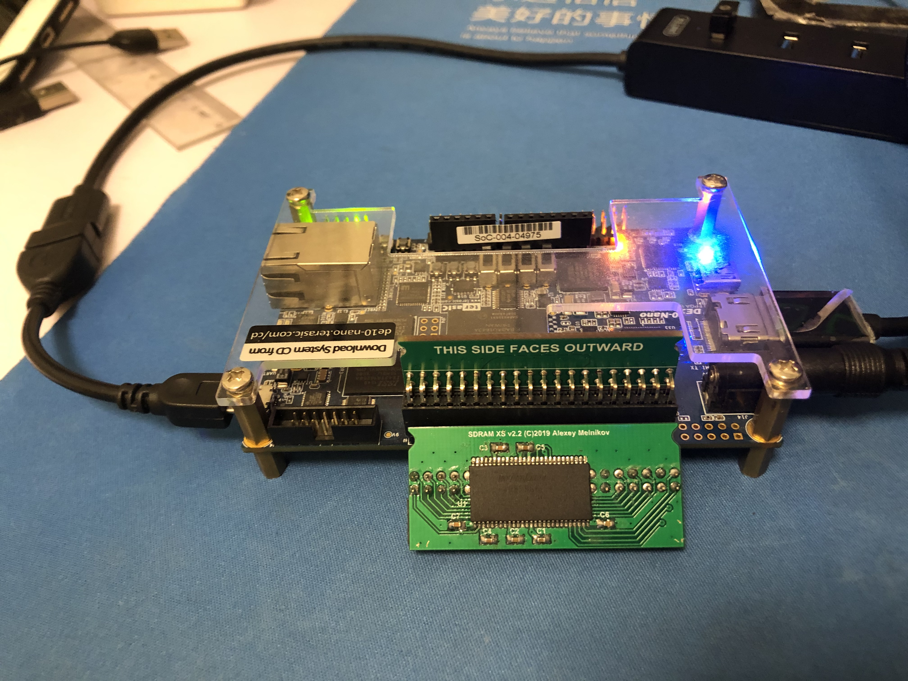

# MiSTer sdram for Nios II
SDRAM daughter card form [MiSTer FPGA](https://github.com/MiSTer-devel)

*SDRAM_xs* version card 32Mb or 64Mb

## Features
- 32M Byte or 64M Byte SDR SDRAM 
- MiSTer SDRAM ip core for Nios II
- SDRAM daughter card <-> GPIO_0
- memory test is OK at 100Mhz 